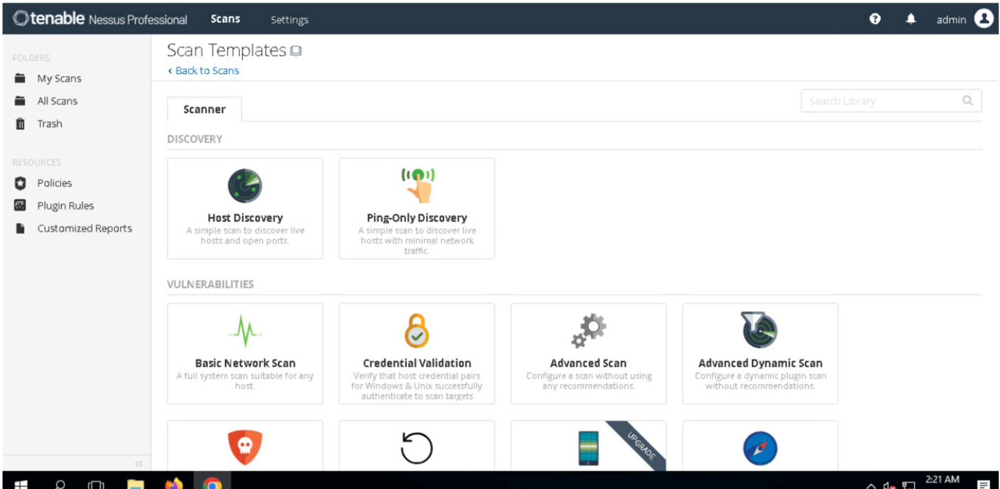
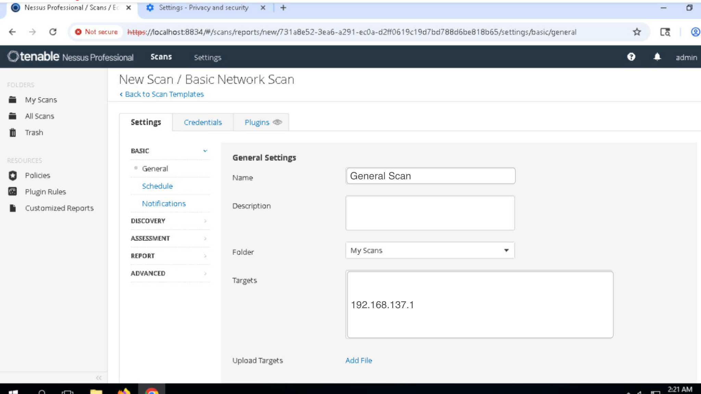
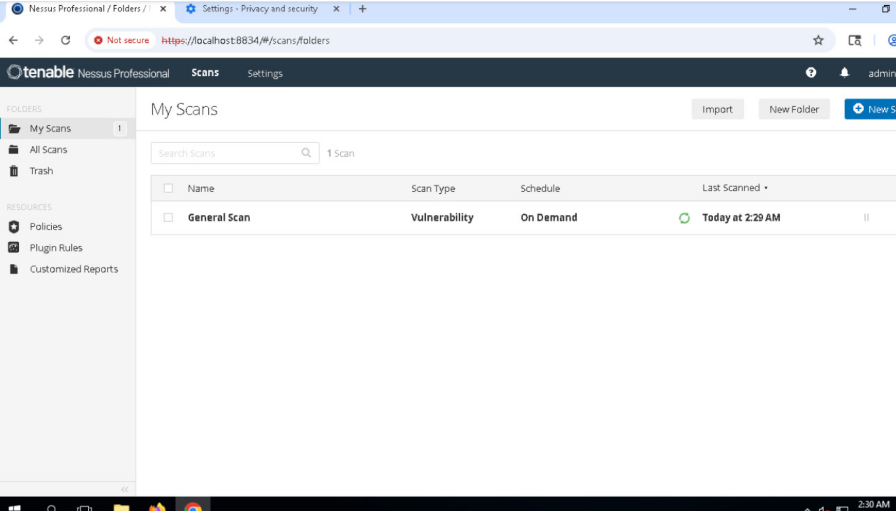
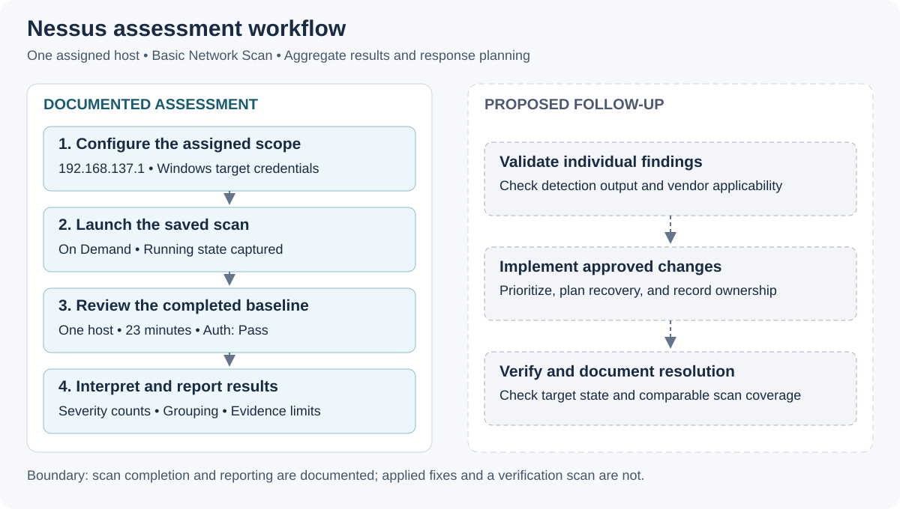
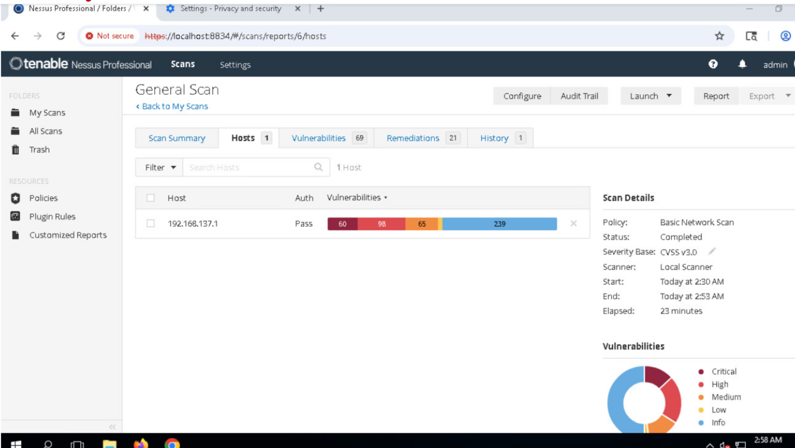
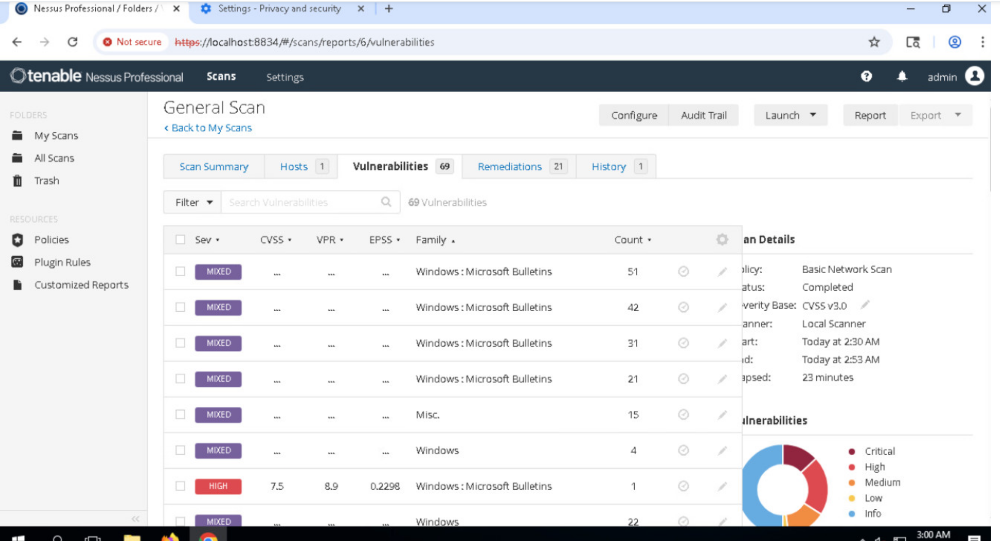

# Nessus Vulnerability Assessment: Authenticated Baseline & Result Triage


**Jump to:** [Method](#assessment-method) · [Results](#observation-1-completion-and-authentication) · [Assessment](#final-assessment) · [Follow-up](#recommended-response-in-a-production-environment) · [Evidence and integrity](#evidence-handling-and-integrity) · [Limitations](#scope-and-limitations)

## Executive Summary

I performed a guided vulnerability assessment of the assigned host, **192.168.137.1**, using Nessus in an authorized uCertify training environment. I configured a **Basic Network Scan** named **General Scan**, supplied the lab's Windows target credentials, launched the assessment, and reviewed the completed results.

The scan assessed **one host** and completed in **23 minutes**. The host view displayed **Auth: Pass**, **CVSS v3.0**, and results in the Critical, High, Medium, Low, and Informational categories. The readable host-bar counts were **60 Critical**, **98 High**, **65 Medium**, and **239 Informational**. The Low count could not be read reliably.

I analyzed the authentication indicator, the severity distribution, and the grouped result display. I then documented a proposed process for validating and prioritizing the reported exposure.

**Final assessment:** Nessus produced a completed baseline with substantial Critical and High scanner-reported results that warrant finding-level review. The evidence establishes scan execution and aggregate results; it does not establish specific exploitability, compromise, applied fixes, or verified resolution.

---

## Project Overview

| Field | Details |
|---|---|
| Case ID | `LAB-NES-002` |
| Status | Completed guided baseline assessment |
| Author | Xavier Tables |
| Documentation updated | October 8, 2026 |
| Documentation date | October 2, 2026 |
| Environment | Authorized uCertify virtual training lab |
| Tool | Tenable Nessus Professional (as displayed) |
| Data source | My lab-session screenshots and completed Nessus results |
| Assigned target | `192.168.137.1` |
| Scan name / template | General Scan / Basic Network Scan |
| Schedule | On Demand |
| Target credentials configured | Windows password credentials for the supplied Administrator account |
| Assessment focus | Authentication evidence, aggregate severity, grouped results, and response planning |
| Final disposition | Baseline recorded; individual applicability and remediation remain unverified |

The lab provided the scanner and the target. One detail I noticed while documenting the project was that the written activity referred to Nessus Essentials, while my screenshots showed **Nessus Professional**. I kept the report tied to what I could actually see in the interface instead of guessing about the license, engine build, or target OS version.

### Skills Demonstrated

- Defining and maintaining the assigned assessment scope.
- Selecting a scan template and configuring a target.
- Distinguishing scanner login credentials from Windows target credentials.
- Following execution from configuration through completion.
- Interpreting authentication, timing, severity, and grouped results.
- Developing response recommendations without overstating the evidence.
- Preserving screenshot evidence and excluding visible passwords.

---

## Assessment Question and Scope

**What did Nessus report about the assigned host, and what conclusions and response priorities were justified by the available evidence?**

The assessment covered the single host specified by the activity. I accessed the Nessus management interface at `https://localhost:8834` inside the lab and scanned `192.168.137.1`. The management address and the assessment target served different purposes.

The activity covered scanner access, browser preparation, scan configuration, execution, and result review. The scanner was preinstalled; downloading Nessus, verifying an installer checksum, and installing it were outside the work performed.

This was a guided assessment inside the provider's controlled environment, which I accessed from my iMac.

---

## Assessment Method

Click a screenshot or the workflow diagram to open its full-size version.

### 1. Access and Browser Preparation

I opened the provided Nessus interface in the lab browser and followed the activity's access procedure. The workflow included a certificate-warning exception for the assigned local management service, clearing the lab browser's browsing data, refreshing the interface, and signing in.

I treated the certificate warning as a management-interface access observation. It did not establish a certificate vulnerability on the scanned target. Clearing browser data was part of the guided preparation workflow, rather than remediation of the target.

### 2. Template and Target Configuration

[](https://raw.githubusercontent.com/XavierTables/CyberSecurity_Portfolio/main/projects/nessus-vulnerability-assessment/evidence/01-scan-template.png)

*Figure 1. Vulnerability scan templates available during my lab session.*

I selected **Basic Network Scan**, named it **General Scan**, and entered the assigned target.

[](https://raw.githubusercontent.com/XavierTables/CyberSecurity_Portfolio/main/projects/nessus-vulnerability-assessment/evidence/02-scan-configuration.png)

*Figure 2. Scan identity, selected template, and assessment target.*

| Configuration | Observed value | Purpose |
|---|---|---|
| Name | General Scan | Identify the assessment and its results |
| Template / policy | Basic Network Scan | Use the vulnerability scan selected for this activity |
| Target | `192.168.137.1` | Keep execution within the assigned scope |
| Schedule | On Demand | Launch the saved scan for this lab session |
| Windows target account | Administrator | Supply the credentials provided for target checks |

I entered the supplied Windows password credentials in the scan's Credentials section. The password-bearing screenshot is excluded from the public evidence.

The Nessus login authorized access to the scanner's interface. The Windows credentials were configured for checks against the target. These are separate authentication contexts.

### 3. Execution and Result Review

I saved the configuration and launched the scan. The running-state capture establishes that the assessment progressed beyond configuration.

[](https://raw.githubusercontent.com/XavierTables/CyberSecurity_Portfolio/main/projects/nessus-vulnerability-assessment/evidence/03-scan-running.png)

*Figure 3. Scan execution in progress.*

I subsequently reviewed the completed host summary and the Vulnerabilities view. The host summary provided status, timing, authentication, and severity information; the vulnerability table showed grouped results.

---

## Evidence Sequence

[](https://raw.githubusercontent.com/XavierTables/CyberSecurity_Portfolio/main/projects/nessus-vulnerability-assessment/images/assessment-workflow.svg)

The diagram summarizes the documented assessment and separates it from the proposed response. It does not assign an absolute scan date.

| Evidence | Recorded state | What it supports |
|---|---|---|
| Figure 1 | Template selection | Basic Network Scan was available for the activity |
| Figure 2 | Scan configuration | General Scan targeted the assigned address |
| Figure 3 | Running scan | The configured assessment was launched |
| Figure 4 | Completed host view | Completion, one assessed host, authentication indicator, timing, and severity counts |
| Figure 5 | Grouped vulnerability view | Interpretation of group labels, families, and displayed counts |

---

## Observation 1: Completion and Authentication

[](https://raw.githubusercontent.com/XavierTables/CyberSecurity_Portfolio/main/projects/nessus-vulnerability-assessment/evidence/04-completed-scan.png)

*Figure 4. Completed baseline results for the assigned host.*

| Field | Observed value |
|---|---|
| Scan | General Scan |
| Status | Completed |
| Hosts | 1 |
| Target | `192.168.137.1` |
| Authentication | Pass |
| Scanner | Local Scanner |
| Severity basis | CVSS v3.0 |
| Displayed start | Today at 2:30 AM |
| Displayed end | Today at 2:53 AM |
| Elapsed | 23 minutes |

### My Analysis

The completed state, one-host summary, and 23-minute runtime showed that the scan finished. Because I had configured the supplied Windows credentials and Nessus displayed **Auth: Pass**, I recorded the scan as successfully authenticated.

What I did *not* assume was that Auth: Pass meant every local check had full coverage. Tenable's own guidance makes that distinction: authentication can succeed without proving that every intended credentialed check had complete visibility. [Tenable credentialed-check guidance][credentialed]

So I kept the claim narrow: authentication passed, while complete local-check coverage remained unverified.

The interface used relative **Today** timestamps. The screenshots do not establish the absolute scan date or the lab VM's time zone. The documentation date identifies when I prepared this report.

---

## Observation 2: Severity Distribution and Triage

| Category | Readable count in the host severity bar | Assessment interpretation |
|---|---:|---|
| Critical | 60 | Prioritize applicability review of these reported results |
| High | 98 | Review alongside Critical results using exposure and impact context |
| Medium | 65 | Assess relevance and include applicable results in the response plan |
| Low | Not reliably readable | Preserve the uncertainty instead of assigning zero |
| Informational | 239 | Retain discovery and context separately from the remediation priority categories |

### My Analysis

The number of Critical and High results was enough to make the host worth deeper review, but the severity bar alone could not tell me which findings truly applied, how exploitable they were, or what exact fix was needed.

The scan displayed **CVSS v3.0**, so I kept that version in the report instead of changing the label. FIRST's guidance also separates technical severity from full risk, which depends on things like asset importance, exposure, and threat context. [FIRST CVSS guidance][cvss]

In a real assessment I would combine the finding details with reachability, asset importance, exploitation evidence, and operational constraints. Those inputs were not available here, so I treated the severity counts as a triage starting point rather than a finished risk ranking.

I also avoided forcing the numbers into a cleaner story than the evidence supported: the Low value was unreadable, and a severity count is not the same thing as a count of unique CVEs.

---

## Observation 3: Grouped Results and Remediation Status

[](https://raw.githubusercontent.com/XavierTables/CyberSecurity_Portfolio/main/projects/nessus-vulnerability-assessment/evidence/05-grouped-results.png)

*Figure 5. Grouped vulnerability results captured during my review.*

| Displayed item | Observation | Supported interpretation |
|---|---|---|
| Vulnerabilities view | Badge showing 69; grouping visible | A displayed view count, not an established unique-CVE total |
| Group severity | MIXED on visible rows | Group members can have differing severities |
| Plugin families | Windows: Microsoft Bulletins, Windows, and Misc. visible | Family context, not proof of a specific CVE or missing patch |
| Remediations tab | Badge showing 21 | Displayed remediation count, not evidence of 21 applied changes |

### My Analysis

The grouped-results view was another place where it would have been easy to overread the interface. Tenable documents that related plugins can sit under one grouped row, and a group can show **MIXED** when the findings inside it have different severities. [Tenable result-grouping guidance][groups]

That meant the **69** badge could not honestly be described as 69 unique CVEs, and the grouped table could not be treated as the same thing as the host severity bar.

The Windows-related plugin families gave me a direction for follow-up, but not enough detail to choose a patch. I would still need the individual plugin title, plugin ID, detection output, affected component, and vendor guidance.

I treated the **21** Remediations badge the same way: it showed what Nessus displayed, not proof that 21 fixes had been applied. The lab evidence did not include remediation or a verification rescan.

---

## Final Assessment

The evidence supports the following conclusions:

- General Scan completed against the assigned host.
- Windows target credentials were configured, and Nessus displayed **Auth: Pass**.
- The host bar contained readable Critical, High, Medium, and Informational counts.
- The Low value was unreadable; it was not recorded as zero.
- Grouping affected how the Vulnerabilities view presented its results.
- The reported Critical and High exposure warranted detailed applicability review.
- The available evidence did not establish compromise, specific exploitability, applied remediation, or verified resolution.

**Disposition:** Completed guided baseline assessment with documented result interpretation and a proposed response workflow.

**Confidence:** High in the recorded configuration and completion states. Conclusions about vulnerability applicability and risk remain limited because finding-level detection evidence and asset context were unavailable.

For me, the value of this project was learning that a finished scan is not the same thing as a finished vulnerability-management cycle. The baseline was complete, while validation, remediation, and verification were still open.

---

## Recommended Response in a Production Environment

The following is my proposed follow-up process. These actions were not performed in the supplied lab.

| Order | Recommended action | Decision or evidence needed |
|---|---|---|
| 1 | Validate the reported Critical and High results | Review each finding's title, plugin ID, affected component, detection output, and applicable vendor guidance |
| 2 | Confirm target and exposure context | Check asset ownership, installed versions, reachable services, and service importance |
| 3 | Set remediation priorities | Combine applicability and technical severity with exposure, threat context, and operational impact |
| 4 | Plan and implement approved changes | Select supported fixes, assess dependencies, and establish recovery and maintenance arrangements |
| 5 | Verify the resulting state | Confirm the intended version or configuration change and repeat a comparable assessment |
| 6 | Document closure or remaining exposure | Record what changed, verification evidence, residual findings, and approved exceptions |

I would avoid prescribing a patch from a group name alone. A change should address an applicable finding and use the relevant vendor's supported resolution.

For verification, I would compare assessments with consistent targets and appropriate check coverage. A lower result count would need investigation if authentication or coverage changed, rather than automatically being treated as successful remediation.

I would escalate an applicable high-impact exposure to the responsible owner under the organization's process, especially when exposure or evidence of exploitation made delay unacceptable. This case does not supply an organizational SLA or evidence of exploitation.

---

## Evidence Handling and Integrity

| Published evidence | Purpose |
|---|---|
| [01-scan-template.png](https://raw.githubusercontent.com/XavierTables/CyberSecurity_Portfolio/main/projects/nessus-vulnerability-assessment/evidence/01-scan-template.png) | Scan-template selection |
| [02-scan-configuration.png](https://raw.githubusercontent.com/XavierTables/CyberSecurity_Portfolio/main/projects/nessus-vulnerability-assessment/evidence/02-scan-configuration.png) | Assessment identity and assigned target |
| [03-scan-running.png](https://raw.githubusercontent.com/XavierTables/CyberSecurity_Portfolio/main/projects/nessus-vulnerability-assessment/evidence/03-scan-running.png) | Execution state |
| [04-completed-scan.png](https://raw.githubusercontent.com/XavierTables/CyberSecurity_Portfolio/main/projects/nessus-vulnerability-assessment/evidence/04-completed-scan.png) | Host results, authentication, and timing |
| [05-grouped-results.png](https://raw.githubusercontent.com/XavierTables/CyberSecurity_Portfolio/main/projects/nessus-vulnerability-assessment/evidence/05-grouped-results.png) | Grouped-result interpretation |
| [assessment-workflow.svg](https://raw.githubusercontent.com/XavierTables/CyberSecurity_Portfolio/main/projects/nessus-vulnerability-assessment/images/assessment-workflow.svg) | Report diagram derived from the documented sequence |

The five screenshots are unchanged copies of my supplied captures with descriptive filenames. Login and credential captures containing visible lab passwords were omitted. Proprietary lab instructions are not reproduced.

The included **SHA256SUMS** records the README, five screenshots, and report diagram. I generated these hashes during portfolio assembly to allow verification of the published files. They are separate from installer verification and from any checksum of a native scan export.

From the downloaded project directory on macOS:

```bash
shasum -a 256 -c SHA256SUMS
```

Changes to a file require updating its checksum.

The activity included an Export → Nessus step, and the interface's Export control was visible. A native exported scan file was not available in the evidence used for this report, so I do not claim that its contents or checksum were inspected.

---

## What I Learned

The biggest lesson from this project was not to let a scanner label do more work than the evidence supports.

**Auth: Pass** told me authentication succeeded; it did not prove perfect local-check coverage. A Critical count told me where to focus; it did not prove exploitability. A grouped result told me related findings were being summarized; it did not mean I was looking at the same number of unique CVEs.

I also got a much clearer picture of the vulnerability-management workflow. Running the scan is only the beginning. The real next steps are validating the finding, understanding the asset and exposure, choosing an approved fix, and then rescanning to verify the result.

Finally, I learned to keep scanner access separate from target authentication and to publish enough evidence to show the work without exposing the lab password.

---

## Scope and Limitations

This project documents the completed guided baseline and aggregate-result review. The available screenshots do not include individual plugin detail pages, named CVE findings, the plugin feed/build record, or independent target-state validation.

I did not perform exploitation, a documented EPSS assessment, applied remediation, or a verification rescan. The scan's exact plugin selection and complete local-check coverage were not established.

Those limits do not make the scan incomplete; they define what I can honestly claim from it. I would rather leave a finding unverified than invent detail that was not present in the lab evidence.

---

## References and Lab Disclosure

- [Tenable: Manage Vulnerabilities][groups]
- [Tenable: Nessus Credentialed Checks][credentialed]
- [FIRST: CVSS v3.1 User Guide, section 2.1][cvss] — severity/risk guidance; the captured scan displayed CVSS v3.0.

[groups]: https://docs.tenable.com/nessus/Content/manage-vulnerabilities.htm
[credentialed]: https://docs.tenable.com/nessus/10_12/Content/NessusCredentialedChecks.htm
[cvss]: https://www.first.org/cvss/v3.1/user-guide

---

*All assessment activity was performed in an authorized uCertify training environment. The provider supplied the scanner, target, and guided activity. Screenshots are from my lab session; this report documents my analysis of that evidence.*
