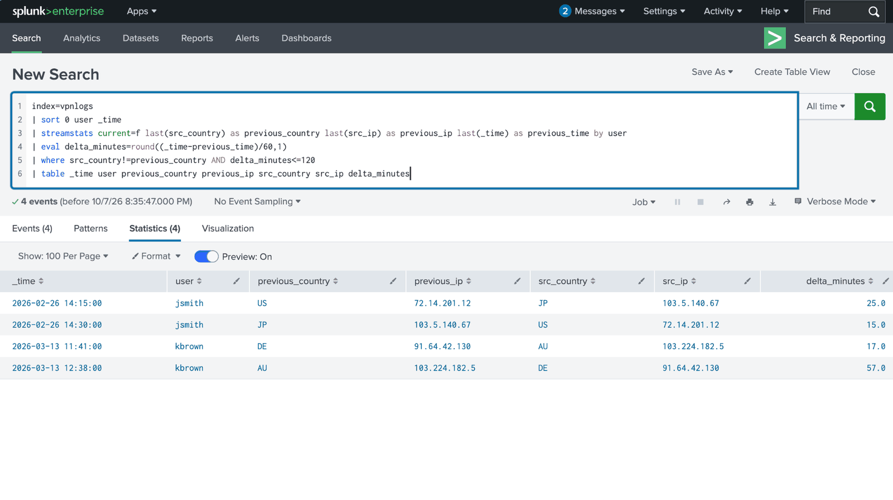
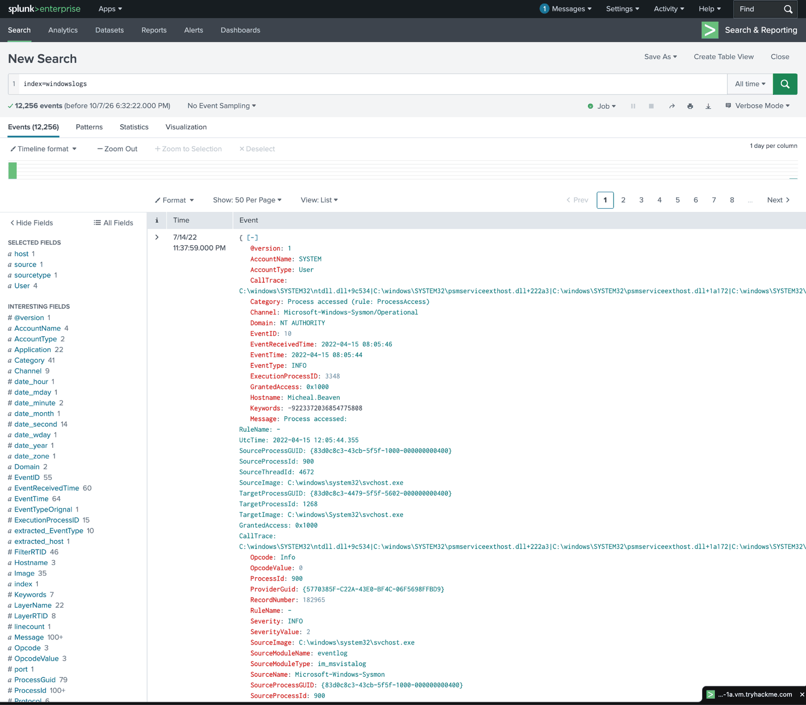
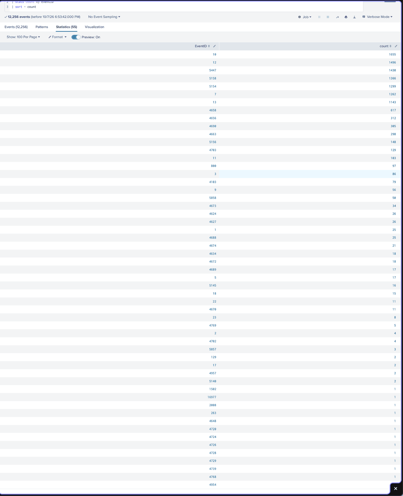
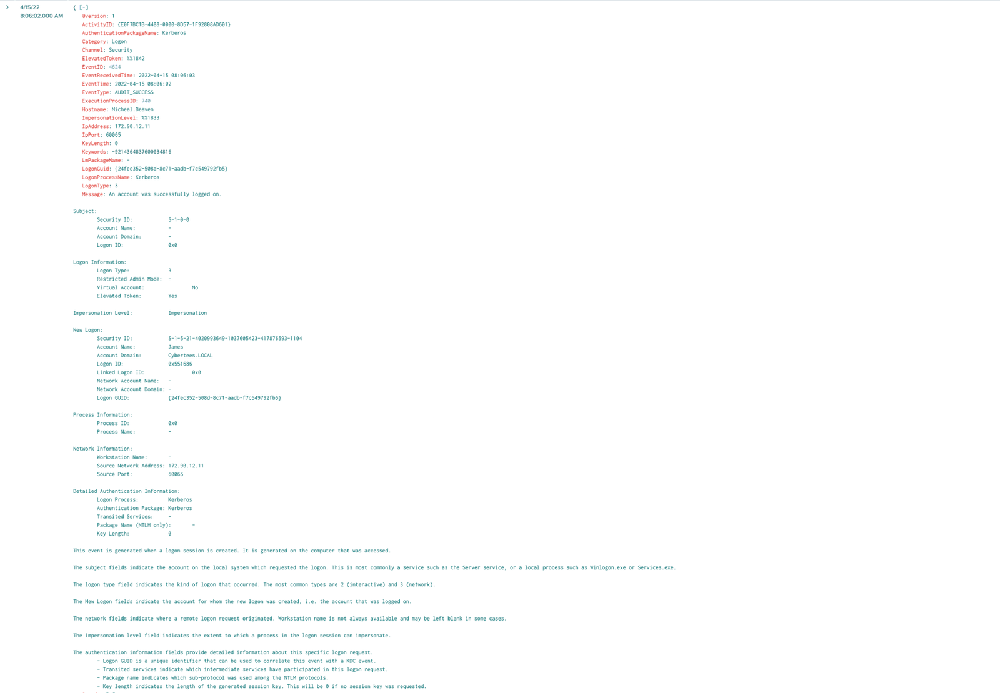
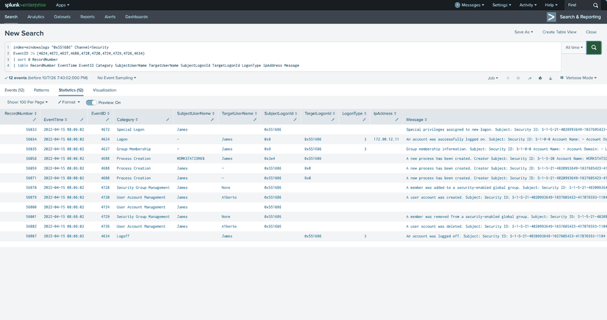
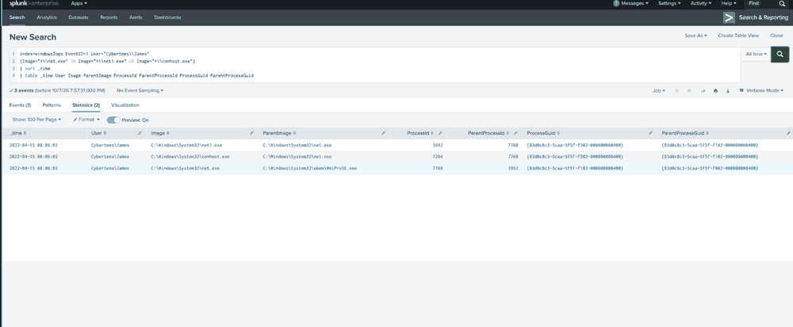
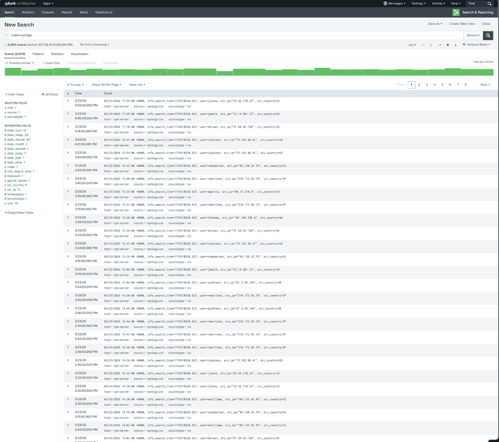
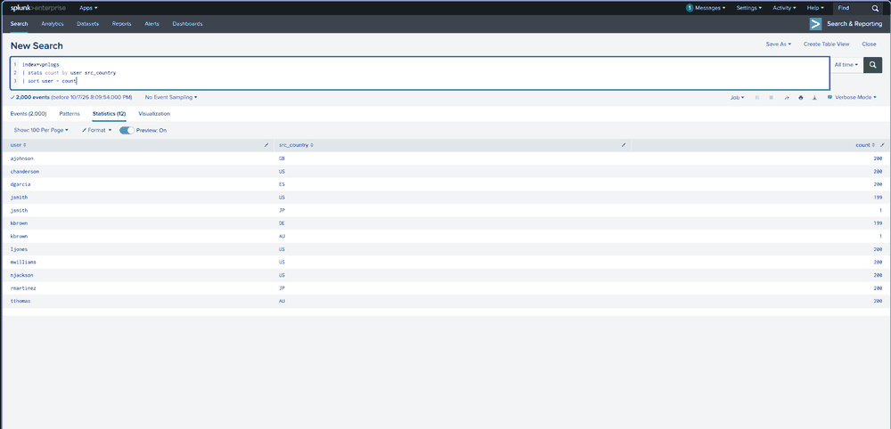
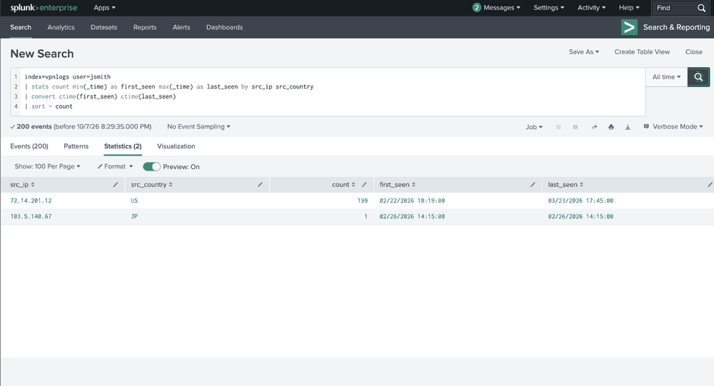

# Splunk SIEM Investigation: Windows Session Correlation & VPN Geographic Anomaly Detection


## 60 Second View

**Problem:** Investigate Windows account-management activity and VPN logins that deviated from each user's observed country baseline in authorized training data.

**Evidence:** Windows Security records and Sysmon process relationships provided investigative leads. VPN baselining isolated **two rare-country events**: one Japan-labelled event for `jsmith` and one Australia-labelled event for `kbrown`, each 1 of 200 events. SPL identified **four rapid country-label transitions** around those two outliers, with gaps of **15–57 minutes**.

**Final disposition:** Suspicious activity; **compromise unconfirmed**. Windows host/session linkage and administrative approval require validation. VPN follow-up requires identity, device, MFA, and routing checks.

[](evidence/09-vpn-rapid-country-switch-detection.png)

*Key screenshot: four transition rows around two outlier events, not four separate rare-country logins. Full evidence and analysis follow below.*

---

**Jump to:** [60 second view](#60-second-view) · [Windows investigation](#part-1--windows-investigation) · [VPN investigation](#part-2--vpn-authentication-investigation) · [Assessment](#final-assessment) · [SPL queries](queries/investigation-queries.md) · [Evidence](#evidence-index) · [Limitations](#scope-and-limitations)

## Executive Summary

I used Splunk and SPL in an authorized TryHackMe training environment to investigate two security-relevant activity patterns: correlated Windows account-management activity and anomalous VPN authentication behavior.

The Windows investigation began with 12,256 events. I profiled the available Event IDs, isolated rare account-management activity, and found a successful network logon for `James`. Searching Logon ID `0x551686` surfaced process creation and activity involving the `Alberto` account. Sysmon showed process relationships involving `WmiPrvSE.exe`, `net.exe`, `conhost.exe`, and `net1.exe`. Security and Sysmon provide complementary evidence involving the same account and time period; the shared host and session boundaries remain unverified.

The VPN investigation analyzed 2,000 authentication events. Behavioral baselining identified two users with rare-country logins. I selected `jsmith` for deeper review because 199 of 200 observed events came from one US-labelled source IP while a single event came from a Japan-labelled source IP. The US-labelled source appeared 25 minutes before and 15 minutes after that event.

**Final disposition:** Suspicious activity identified in both datasets; additional authorization, identity, and endpoint validation would be required before classifying either case as a confirmed security incident.

---

## Project Overview

| Field | Details |
|---|---|
| Case ID | `LAB-SIEM-003` |
| Status | Completed lab investigation |
| Author | Xavier Tables |
| Documentation updated | October 9, 2026 |
| Environment | Authorized TryHackMe training environment |
| Tool | Splunk |
| Query language | SPL |
| Windows dataset | `index=windowslogs` |
| Windows events | 12,256 |
| VPN dataset | `index=vpnlogs` |
| VPN events | 2,000 |
| Primary telemetry | Windows Security, Sysmon, VPN authentication |
| Investigation focus | Session correlation, process analysis, behavioral baselining, geographic anomaly detection |
| Executed search scope | All time in the supplied historical datasets |
| Displayed time zone | Not established by the published captures |
| Final disposition | Suspicious activity requiring additional validation |

### Search Scope and Reproducibility

The Windows authentication capture shows `Hostname=Micheal.Beaven` and an event time of `2022-04-15 08:06:02`. The rapid-country-switch results show VPN events on `2026-02-26` and `2026-03-13`. These are historical dataset timestamps; the October 2026 search times are when I worked through the lab.

I used **All time** to explore the supplied data. The published captures do not establish the complete earliest/latest dataset bounds or the Splunk display time zone, so I do not label those timestamps as UTC or Cleveland local time.

The recorded session searches use the Logon ID without a hostname filter, and the Security and Sysmon result tables do not display the computer name. When reproducing this investigation, I would verify the same event computer, constrain the time window, and distinguish subject and target Logon IDs before treating the correlation as a production finding. A Windows Logon ID is unique only between reboots on the same computer. [Microsoft Logon ID guidance][logoff]

---

## Investigation Objectives

This project was designed to answer two primary questions:

### Windows

**Could the rare Windows account-management activity be connected to a specific authenticated session and supporting process telemetry?**

### VPN

**Did any VPN authentication activity significantly deviate from individual users' observed geographic behavior?**

I did not want to start with the assumption that either dataset showed an attack. I followed the evidence, correlated related events, tested different explanations, and documented where the telemetry was strong and where it still left questions.

---

## Skills Demonstrated

- SPL dataset profiling, filtering, field selection, and event-frequency analysis
- Windows authentication and account-management event interpretation
- Logon ID investigation and Security/Sysmon process comparison
- Parent/child process analysis using ProcessGuid and ParentProcessGuid
- VPN behavioral baselining and geographic detection using `stats`, `eventstats`, `eval`, `where`, and `streamstats`
- Evidence-based triage, investigation documentation, and escalation planning

The primary SPL searches used during the investigation are documented in [the SPL Investigation Query Log](./queries/investigation-queries.md).

---

## Technical Choices and Their Limits

| Term | Why I used it in this case |
|---|---|
| `streamstats` | After `sort 0 user _time`, `current=f` and `last(...)` retained each user's previous country, IP, and time. Comparing consecutive events produced four transition rows around two outliers. Country labels require routing and geolocation validation. |
| `ProcessGuid` | Identifies a specific process instance in Sysmon and helps avoid ambiguity when Windows reuses numeric process IDs. I used it to examine process ancestry. |
| Parent-child relationships | Matching a child's `ParentProcessGuid` to its parent's `ProcessGuid` supports ancestry within Sysmon. The observed WMI-associated ancestry does not establish malicious intent or a verified Security-to-Sysmon session link. |
| Logon Type 3 | Indicates network authentication. It led me to review the source IP, account, and Logon ID; it does not establish Remote Desktop access or malicious activity. |
| Windows Event 4724 | Records a password-reset attempt. I reviewed the subject and target accounts; the published Splunk timeline omits the audit outcome, so I did not claim that reset succeeded. |

Definitions: [Splunk streamstats](https://help.splunk.com/en/splunk-enterprise/search/spl-search-reference/9.4/search-commands/streamstats), [Microsoft Sysmon](https://learn.microsoft.com/en-us/sysinternals/downloads/sysmon), [Microsoft Event 4624](https://learn.microsoft.com/en-us/previous-versions/windows/it-pro/windows-10/security/threat-protection/auditing/event-4624), and [Microsoft Event 4724][reset].

---

## Part 1 — Windows Investigation

### Dataset Exploration

I began with the complete Windows dataset rather than immediately searching for a specific security event.

```spl
index=windowslogs
```

The dataset contained **12,256 events** and exposed security-relevant fields including Event IDs, accounts, hosts, processes, network information, Windows Security telemetry, and Sysmon telemetry.



*Figure 1. Broad Windows dataset search used to establish the available telemetry before narrowing the investigation.*

---

### Event ID Profiling

I counted events by Event ID to identify both common and unusual activity.

```spl
index=windowslogs
| stats count by EventID
| sort - count
```

The dataset contained **55 distinct Event IDs**.

Several account-management events appeared only once, including:

- 4720 — user account created
- 4724 — password-reset attempt
- 4726 — user account deleted
- 4728 — member added to a security-enabled global group
- 4729 — member removed from a security-enabled global group
- 4739 — domain policy changed

I treated the rare events as leads for deeper review, not as proof of malicious behavior.



*Figure 2. Event-frequency analysis used to identify low-frequency account-management activity for deeper review.*

---

### Finding 1 — Correlated Windows Account-Management Activity

#### Initial Account-Management Cluster

Reviewing the rare account-management activity revealed a cluster involving:

- subject account `James`
- target account `Alberto`
- shared Logon ID `0x551686`
- host `Micheal.Beaven`

The related activity included security-enabled global group membership changes, creation of the `Alberto` account, a password-reset attempt against `Alberto`, removal from the security-enabled global group, and deletion of the `Alberto` account.

A nearby Event 4739 password-policy change used different host and session context, so I did not automatically include it in the same activity chain.

---

#### James Network Authentication

I searched for Event ID 4624 using the Logon ID observed in the account-management events.

The resulting event showed:

| Field | Observed Value |
|---|---|
| Event ID | 4624 |
| Account | `James` |
| Domain | `Cybertees.LOCAL` |
| Logon Type | 3 |
| Source IP | `172.90.12.11` |
| Authentication package | Kerberos |
| Target Logon ID | `0x551686` |
| Elevated token | Yes |

Logon Type 3 showed that this was a network logon. The matching Logon ID suggested a session link between James's authentication and the account-management activity. The published timeline does not display or filter the hostname, so the host and session boundaries still need verification.



*Figure 3. Successful network authentication associated with Logon ID `0x551686`.*

---

#### Security Session Reconstruction

I reconstructed the relevant Windows Security events using the shared session identifier.

Because the relevant events displayed the same second, I used Windows Security `RecordNumber` values to establish the clearest available order within that log channel.

The observed sequence included:

- Event 4672 — special privileges associated with the session
- Event 4624 — successful James network authentication
- Event 4627 — group membership information
- Event 4688 — process creation
- Event 4728 — member added to a security-enabled global group
- Event 4720 — `Alberto` account created
- Event 4724 — password-reset attempt against `Alberto`
- Event 4729 — member removed from the security-enabled global group
- Event 4726 — `Alberto` account deleted
- Event 4634 — James session logged off

Event 4724 establishes a **password-reset attempt**. The published timeline does not display its audit-success/failure field, so the public evidence does not establish whether that attempt succeeded. I would preserve the event's audit outcome before making a stronger claim. [Microsoft Event 4724 guidance][reset]



*Figure 4. Windows Security activity ordered by RecordNumber and associated with Logon ID `0x551686`.*

---

#### Cross-Source Process Correlation

Windows Security Event ID 4688 showed process-creation activity associated with the session.

I then used Sysmon Event ID 1 to independently examine the process relationships.

Sysmon showed:

```text
WmiPrvSE.exe
    |
    +-- net.exe
          |
          +-- conhost.exe
          |
          +-- net1.exe
```

The ProcessGuid and ParentProcessGuid values supported the parent-child relationships.



*Figure 5. Sysmon process telemetry corroborating the process relationship under `Cybertees\James`.*

#### Analysis

The Sysmon records showed the same account and displayed second as the Security activity. ProcessGuid relationships support the process ancestry within Sysmon. This complements the Security timeline but does not independently prove both sources describe the same host-bound session; I would verify the event computer and session boundaries.

The evidence let me examine network authentication, elevated session context, WMI-associated process ancestry, `net.exe` and `net1.exe` execution, account creation, group membership changes, a password-reset attempt, account deletion, and logoff as a related activity cluster.

What I still could not answer was whether James was supposed to be doing it. `WmiPrvSE.exe` in the process ancestry supports WMI-associated execution, but it does not prove malicious remote WMI by itself. I also could not confirm from the supplied data that the security-enabled global group was privileged.

#### Windows Finding Disposition

**Suspicious administrative activity — authorization unverified.**

The session would warrant escalation or authorization validation in a production SOC. The supplied telemetry does not provide enough evidence to classify the activity as confirmed malicious behavior or account compromise.

---

## Part 2 — VPN Authentication Investigation

### VPN Dataset Overview

I next examined the VPN dataset.

```spl
index=vpnlogs
```

The dataset contained **2,000 events**, **10 users**, **12 source IP addresses**, and **6 source countries**. Useful fields included `user`, `src_ip`, `src_country`, and `_time`.



*Figure 6. Initial VPN dataset review before behavioral analysis.*

---

### Finding 2 — VPN Geographic Authentication Anomaly

#### Country Baseline

I grouped VPN activity by user and source country.

```spl
index=vpnlogs
| stats count by user src_country
| sort user - count
```

Most users displayed consistent geographic behavior.

Two accounts contained one rare-country event:

| User | Primary Country | Count | Rare Country | Count |
|---|---|---:|---|---:|
| `jsmith` | US | 199 | JP | 1 |
| `kbrown` | DE | 199 | AU | 1 |



*Figure 7. Per-user VPN country distribution showing two geographic outliers.*

I treated the rare country as a reason to investigate further, not as proof that the account was compromised.

---

#### jsmith Behavioral Baseline

I selected `jsmith` for deeper investigation.

The account showed:

| Source IP | Country | Count |
|---|---|---:|
| `72.14.201.12` | US | 199 |
| `103.5.140.67` | Japan | 1 |

The Japanese source appeared exactly once.



*Figure 8. Source-IP and country baseline for `jsmith`.*

This established an unusually stable observed pattern: **199 of 200 VPN events came from one US source IP.**

---

#### Reusable Rare-Country Detection

I converted the manual country observation into a reusable SPL detection.

```spl
index=vpnlogs
| stats count by user src_country
| eventstats sum(count) as user_total by user
| eval country_pct=round((count/user_total)*100,2)
| where country_pct < 5
| sort country_pct
| table user src_country count user_total country_pct
```

The search identified:

- `jsmith` / Japan — 1 of 200 events — 0.50%
- `kbrown` / Australia — 1 of 200 events — 0.50%

The 5% value was used as an investigative threshold for this training dataset and is not presented as a universal SOC standard.

---

#### Rapid Geographic Switching

I then created an SPL search that compared each VPN event with the user's immediately previous event.

```spl
index=vpnlogs
| sort 0 user _time
| streamstats current=f last(src_country) as previous_country last(src_ip) as previous_ip last(_time) as previous_time by user
| eval delta_minutes=round((_time-previous_time)/60,1)
| where src_country!=previous_country AND delta_minutes<=120
| table _time user previous_country previous_ip src_country src_ip delta_minutes
```

The search automatically identified:

- `jsmith`: US → Japan in **25 minutes**
- `jsmith`: Japan → US in **15 minutes**
- `kbrown`: Germany → Australia in **17 minutes**
- `kbrown`: Australia → Germany in **57 minutes**


*Figure 9. Reusable SPL search identifying rapid changes in source country.*

For `jsmith`, the sequence was:

```text
US
 |
25 minutes
 |
 v
Japan
 |
15 minutes
 |
 v
US
```

If the geographic labels accurately reflected physical user location, this sequence would be physically implausible.

#### Analysis

The baseline and rapid-switch results gave me a strong geographic inconsistency and an impossible-travel-style signal, but still not enough to call it credential theft or unauthorized access.

There were several explanations I could not rule out from the VPN data alone, including corporate VPN or proxy routing, inaccurate IP geolocation, shared infrastructure, legitimate remote access, travel, or another routing condition.

#### VPN Finding Disposition

**Suspicious geographic inconsistency — identity validation required; insufficient evidence to confirm account compromise.**

In a production SOC, I would escalate the activity for identity and device validation before classifying the event as malicious.

---

## Final Assessment

| Finding | Supported assessment | Validation still needed |
|---|---|---|
| Windows activity | Security records matching James's Logon ID and complementary Sysmon process relationships suggest a suspicious administrative activity cluster; cross-source host/session linkage remains unverified. | Verify host/session boundaries, administrative approval, affected group privileges, and surrounding endpoint activity. |
| VPN activity | `jsmith` and `kbrown` show rapid changes in country labels against stable observed baselines. | Verify account owner, device, MFA, source infrastructure, and geolocation reliability. |

**Overall disposition: Suspicious activity requiring further validation. The supplied telemetry does not confirm compromise.**

---

## Scope and Limitations

This investigation was performed in an authorized TryHackMe training environment using supplied Windows and VPN datasets.

The analysis is limited to the available telemetry.

### Windows Limitations

The available evidence did not establish:

- whether James's activity was authorized
- whether James's credentials were compromised
- whether `172.90.12.11` represented an approved system
- whether the WMI-associated execution was malicious
- whether the affected security-enabled global group was privileged
- whether additional endpoint activity occurred outside the supplied telemetry
- the audit outcome of the password-reset attempt from the published timeline

The host, time-window, and time-zone validation still needed is documented in [Search Scope and Reproducibility](#search-scope-and-reproducibility).

One working query exposed a training-lab password inside a command-line field. That screenshot was intentionally excluded from the public evidence set.

### VPN Limitations

The VPN dataset did not provide:

- MFA results
- identity-provider authentication details
- device identity
- source-IP reputation
- VPN/proxy ownership information
- authoritative IP-geolocation confidence
- endpoint activity associated with the login
- user travel information
- confirmation from the account owner

The geographic anomaly therefore cannot independently establish credential compromise.

---

## Recommended Production SOC Follow-Up

### Windows Activity

In a production environment, I would:

1. Validate whether James's network session was expected and authorized.
2. Identify the system associated with `172.90.12.11`.
3. Review identity and Active Directory authentication records.
4. Compare the account-management activity with approved administrative tasks or change requests.
5. Review EDR and additional Sysmon telemetry surrounding the session.
6. Investigate additional WMI and remote-management activity.
7. Review service creation, scheduled tasks, PowerShell, and related process telemetry.
8. Identify the affected security group and determine its privileges.
9. Review subsequent activity involving `Alberto`.
10. Escalate the session if authorization could not be confirmed.

### VPN Activity

For the `jsmith` anomaly, I would:

1. Validate the login with the account owner.
2. Review MFA challenge and approval records.
3. Identify the device associated with the login.
4. Review identity-provider logs surrounding the event.
5. Investigate reputation and ownership information for `103.5.140.67`.
6. Determine whether VPN, proxy, or shared infrastructure could explain the location.
7. Review endpoint activity after the authentication.
8. Check for password resets or additional authentication anomalies.
9. Review other users for related infrastructure.
10. Escalate or contain the account if additional evidence supported unauthorized access.

---

## What I Learned

Before this project, I mostly thought of Splunk as a place to search through logs. What clicked for me here was that every useful search can create the next question. I could start broad, find something unusual, and keep moving deeper depending on what the evidence showed.

The Windows investigation made that clear. A rare account-management event led me to a Logon ID, that Logon ID led me to James's network session, and then Security and Sysmon provided complementary evidence involving the same account and time period, without independently proving every host and session boundary. I started to understand why correlation matters more than looking at one event by itself.

The VPN side taught me a different lesson. The Japan-labelled event looked suspicious, and the nearby US-labelled events made it worth a closer look. I still kept VPN routing, inaccurate geolocation, and other explanations open. It showed me why an investigation has to test the theory instead of treating an unusual country as the answer.

The biggest lesson I took from the project was patience. Suspicious does not automatically mean malicious. My job as the analyst is to keep following the evidence, understand the context, and be clear about what I can prove and what still needs validation.

---

## Evidence Index

Each item below links directly to the screenshot used in the investigation.

| Evidence | Purpose |
|---|---|
| [`01-windows-data-overview.png`](./evidence/01-windows-data-overview.png) | Establish Windows dataset scope |
| [`02-windows-eventid-distribution.png`](./evidence/02-windows-eventid-distribution.png) | Identify rare Windows activity |
| [`03-james-network-logon.png`](./evidence/03-james-network-logon.png) | Correlate James authentication with Logon ID |
| [`04-security-session-timeline.png`](./evidence/04-security-session-timeline.png) | Reconstruct Windows Security activity |
| [`05-sysmon-process-correlation.png`](./evidence/05-sysmon-process-correlation.png) | Corroborate process lineage using Sysmon |
| [`06-vpn-data-overview.png`](./evidence/06-vpn-data-overview.png) | Establish VPN dataset scope |
| [`07-vpn-country-baseline.png`](./evidence/07-vpn-country-baseline.png) | Identify geographic outliers |
| [`08-jsmith-ip-baseline.png`](./evidence/08-jsmith-ip-baseline.png) | Establish `jsmith` source-IP baseline |
| [`09-vpn-rapid-country-switch-detection.png`](./evidence/09-vpn-rapid-country-switch-detection.png) | Detect rapid geographic transitions |

Nine distinct screenshots accompany the relevant analysis; the rapid-switch capture is also featured in the 60 second view. The query log records the full search trail; individual captures do not independently establish every interpretation in that trail.

---

## Technical References

- [Microsoft: Event 4624 — successful logon](https://learn.microsoft.com/en-us/previous-versions/windows/it-pro/windows-10/security/threat-protection/auditing/event-4624)
- [Microsoft: Event 4634 — logoff and Logon ID scope][logoff]
- [Microsoft: Event 4724 — password-reset attempt][reset]
- [Splunk: streamstats](https://help.splunk.com/en/splunk-enterprise/search/spl-search-reference/9.4/search-commands/streamstats)
- [Splunk: sort](https://help.splunk.com/en/splunk-enterprise/search/spl-search-reference/9.4/search-commands/sort)

[logoff]: https://learn.microsoft.com/en-us/previous-versions/windows/it-pro/windows-10/security/threat-protection/auditing/event-4634
[reset]: https://learn.microsoft.com/en-us/previous-versions/windows/it-pro/windows-10/security/threat-protection/auditing/event-4724

---

## Lab Disclosure

This project was completed in an authorized TryHackMe training environment.

TryHackMe supplied the Splunk environment and training datasets. The screenshots, SPL searches, investigative pivots, evidence interpretation, findings, and final assessment documented here represent my analysis of the supplied telemetry.

This report does not reproduce proprietary room instructions, challenge answers, credentials, or an answer key.

All security analysis was performed within the authorized training environment.
