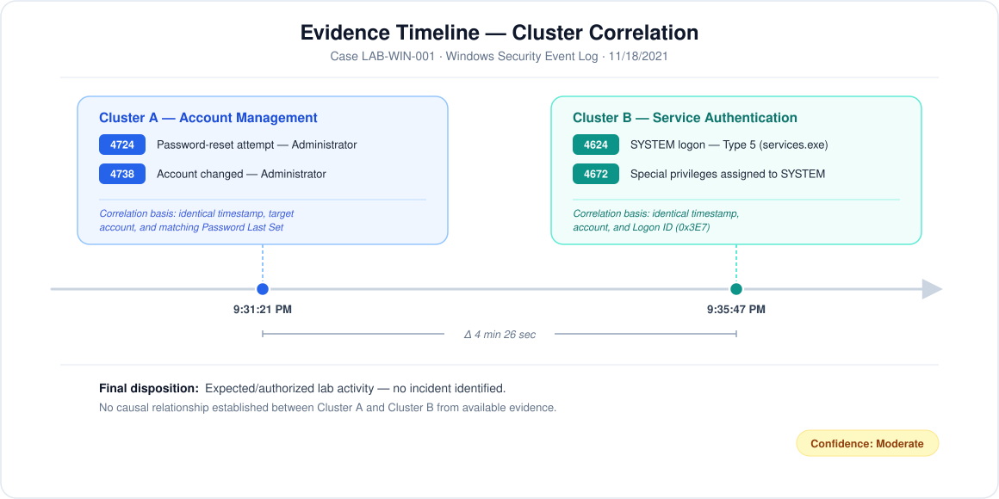

# Windows Security Log Triage: Privileged Account and Service Activity

## Executive Summary

I analyzed Windows Security events from an authorized uCertify training VM to determine whether a privileged-account password reset and later privileged logon activity indicated unauthorized access.

The Security log contained **6,530 events**. I manually triaged four relevant records—**4724, 4738, 4624, and 4672**—and organized them into two activity clusters:

1. An Administrator password reset and account-change event.
2. A local SYSTEM service logon that received expected operating-system privileges.

The available evidence did **not** show a remote or interactive Administrator logon. I classified the activity as **expected within the training environment**, with the important condition that an Administrator password reset would require change-ticket or owner validation in a production SOC.

## Project Highlights

- Reviewed a Windows Security log containing **6,530 events**.
- Triaged **four security-relevant events** across two activity clusters.
- Correlated events using timestamps, accounts, Logon IDs, logon type, process path, and network fields.
- Distinguished a **service logon (Type 5)** from an interactive or remote user logon.
- Documented an initial priority, analyst assessment, disposition, confidence level, and escalation criteria.
- Exported the Security log as an `.evtx` file for preservation and further analysis.

## Case Summary

| Field | Details |
|---|---|
| Case ID | `LAB-WIN-001` |
| Environment | Authorized uCertify Windows training VM |
| Data source | Windows Security Event Log |
| Tool used | Windows Event Viewer |
| Events in log | 6,530 |
| Events manually triaged | 4 |
| Initial priority | Medium — privileged-account password reset |
| Final disposition | Expected/authorized lab activity; no incident identified from available evidence |
| Confidence | Moderate |

## Investigation Objective

Determine whether the observed account-management and privileged-logon events showed evidence of:

- Unauthorized modification of the Administrator account
- Remote or interactive use of the Administrator account
- Suspicious privilege assignment
- Malicious service activity

## Scope and Method

I reviewed selected records in Windows Event Viewer and compared the following fields:

- Event ID and timestamp
- Subject and target accounts
- Logon ID and logon type
- Process name and process ID
- Source network address
- Authentication package
- Changed account attributes
- Assigned privileges

I treated each record as evidence—not proof of malicious activity by itself—and used the surrounding context to reach a disposition.

## Filtering Methodology

Rather than manually paging through all 6,530 Security events, I filtered the exported log to a curated set of high-signal event IDs covering authentication, privileged logons, account management, and service installation. This reduced the dataset to a small number of candidate events, which I then reviewed individually for relevance to the Administrator password-reset activity.

## Evidence Timeline

...

| Time | Event ID | Observation | Analyst Assessment |
|---|---:|---|---|

| 11/18/2021 9:31:21 PM | 4724 | Password-reset attempt targeting `Administrator` | Security-relevant account-management activity requiring validation |

| 11/18/2021 9:31:21 PM | 4738 | `Administrator` account changed; Password Last Set matched the timestamp | Corroborates the password-reset activity |

| 11/18/2021 9:35:47 PM | 4624 | `NT AUTHORITY\SYSTEM` logged on with Logon Type 5 through `services.exe` | Local service logon, not an interactive Administrator session |

| 11/18/2021 9:35:47 PM | 4672 | Sensitive privileges assigned to the SYSTEM session | Expected companion event for the privileged SYSTEM logon |

## Finding 1: Administrator Password Reset and Account Change

### Event 4724 — Password-Reset Attempt

| Field | Observed Value |
|---|---|
| Log | Security |
| Timestamp | 11/18/2021 9:31:21 PM |
| Provider | Microsoft Windows security auditing |
| Keyword | Audit Success |
| Subject account | `WIN-KRLBFUPGGRQ$` under SYSTEM context |
| Subject Logon ID | `0x3E7` |
| Target account | `Administrator` |
| Target system | `UCERTIFY-CV03` |
| Source IP | Not provided |
| Message | An attempt was made to reset an account's password |

### Event 4738 — User Account Changed

| Field | Observed Value |
|---|---|
| Timestamp | 11/18/2021 9:31:21 PM |
| Target account | `Administrator` |
| Password Last Set | 11/18/2021 9:31:21 PM |
| Old UAC value | `0x210` |
| New UAC value | `0x210` |
| Message | A user account was changed |

### Analysis

Events 4724 and 4738 occurred at the same second and referenced the same Administrator account. The matching **Password Last Set** timestamp supports the conclusion that Event 4738 resulted from the password-reset activity. The old and new UAC values were identical, so I did not observe evidence of an account-control change in the captured record.

The activity was expected in this training environment. In production, however, I would keep the case open until the reset was matched to an approved request or confirmed with the responsible administrator. A success audit indicates that the operation succeeded; it does not establish that the action was authorized.

## Finding 2: Privileged SYSTEM Service Logon

### Event 4624 — Successful Logon

| Field | Observed Value |
|---|---|
| Timestamp | 11/18/2021 9:35:47 PM |
| New logon account | `NT AUTHORITY\SYSTEM` |
| Logon ID | `0x3E7` |
| Logon type | `5` — Service |
| Elevated token | Yes |
| Process ID | `0x228` |
| Process name | `C:\Windows\System32\services.exe` |
| Logon process | `Advapi` |
| Authentication package | `Negotiate` |
| Source IP and port | Not provided (`-`) |

### Event 4672 — Special Privileges Assigned

Event 4672 occurred at the same timestamp and matched the SYSTEM account and Logon ID `0x3E7`. The assigned rights included sensitive privileges such as `SeDebugPrivilege`, `SeBackupPrivilege`, `SeRestorePrivilege`, and `SeImpersonatePrivilege`.

### Analysis

The evidence supports a local Windows service session:

- Logon Type 5 identifies a service logon.
- The new logon account was `NT AUTHORITY\SYSTEM`.
- The initiating executable was the expected Windows path `C:\Windows\System32\services.exe`.
- No source network address or source port was present.
- Event 4672 matched the SYSTEM session and documented its expected sensitive privileges.

This was **not evidence of an interactive or remote Administrator logon**. Event 4672 can appear high risk when viewed alone, but Microsoft notes that SYSTEM logons commonly generate this event. The account, logon type, process, and network context were necessary to interpret it correctly.

## Correlation Decision

I grouped the evidence into two clusters rather than forcing all four events into one attack narrative:

### Cluster A — Account Management

- Event 4724: Administrator password-reset attempt
- Event 4738: Administrator account changed
- Correlation basis: identical timestamp, target account, and matching Password Last Set value

### Cluster B — Service Authentication

- Event 4624: SYSTEM service logon
- Event 4672: sensitive privileges assigned to the new SYSTEM session
- Correlation basis: identical timestamp, account, computer, and Logon ID

The service activity occurred several minutes after the password reset, but the available evidence did not establish a causal relationship between the two clusters. I therefore documented them separately.

## Triage Disposition

**Final determination:** Expected activity in the authorized training environment; no security incident identified from the available evidence.

**Reasoning:**

- The Administrator password reset was corroborated by a matching account-change event.
- The later successful logon belonged to SYSTEM—not Administrator.
- Logon Type 5 and `services.exe` supported normal service activity.
- No remote source address was recorded.
- The privileged Event 4672 matched the expected SYSTEM session.
- No captured event showed an interactive, network, or Remote Desktop logon by Administrator.

**Confidence: Moderate.** The Windows events support the disposition, but the lab did not provide production change records, EDR telemetry, SIEM correlation, or complete process lineage.

## Production Escalation Criteria

I would escalate this activity if any of the following were present:

- No approved password-reset ticket or administrator confirmation
- An unexpected subject account resetting the Administrator password
- A remote or unfamiliar source IP
- An Administrator logon using Type 2, 3, or 10 after the reset
- Repeated Event 4625 failures followed by a successful Event 4624
- Event 4648 showing unexpected explicit credential use
- Event 4688 showing a suspicious process near the reset time
- Event 4697 or System Event 7045 showing an unapproved service installation
- Unexpected changes to privileged-group membership or account-control flags

## Recommended Next Steps

In a production investigation, I would:

1. Validate the password reset against a ticket, maintenance window, or account-owner confirmation.
2. Review nearby authentication failures and successful logons for the Administrator account.
3. Identify the service responsible for the Type 5 logon and validate its image path and digital signature.
4. Review process-creation and service-installation events around both timestamps.
5. Correlate the activity with EDR, Sysmon, SIEM, identity, and network telemetry when available.
6. Preserve the relevant events and document the final disposition in the case record.

## Log Export and Evidence Handling

I exported the Security log as `security_logs.evtx` for preservation and possible analysis in another platform.

I would review an exported log for sensitive usernames, hostnames, IP addresses, and organizational information before publishing it. For this portfolio, screenshots provide the necessary evidence without exposing the full event-log dataset.

## Skills Demonstrated

- Windows Event Viewer and Security log navigation
- Windows authentication and account-management event analysis
- Event correlation using timestamps and Logon IDs
- Privileged-account triage
- Service-logon interpretation
- Benign-versus-suspicious activity assessment
- Evidence-based case documentation
- Incident disposition and escalation planning
- `.evtx` log export and evidence awareness

## Scope and Limitations

This investigation used selected Windows events from an authorized training VM. I did not use a SIEM, EDR platform, or Sysmon in this project, and I do not present those tools as part of the completed work. My conclusions are limited to the evidence shown.

I also did not assign a MITRE ATT&CK technique because the available evidence did not establish malicious behavior. Potentially security-relevant activity should not be labeled as an attack without supporting evidence.

## References

- [Microsoft Learn: Event 4624 — An account was successfully logged on](https://learn.microsoft.com/en-us/previous-versions/windows/it-pro/windows-10/security/threat-protection/auditing/event-4624)
- [Microsoft Learn: Event 4672 — Special privileges assigned to new logon](https://learn.microsoft.com/en-us/previous-versions/windows/it-pro/windows-10/security/threat-protection/auditing/event-4672)
- [Microsoft Learn: Event 4724 — An attempt was made to reset an account's password](https://learn.microsoft.com/en-us/previous-versions/windows/it-pro/windows-10/security/threat-protection/auditing/event-4724)
- [Microsoft Learn: Event 4738 — A user account was changed](https://learn.microsoft.com/en-us/previous-versions/windows/it-pro/windows-10/security/threat-protection/auditing/event-4738)

---

*All activity was performed in an authorized training environment. Screenshots and analysis are from my own lab session.*
