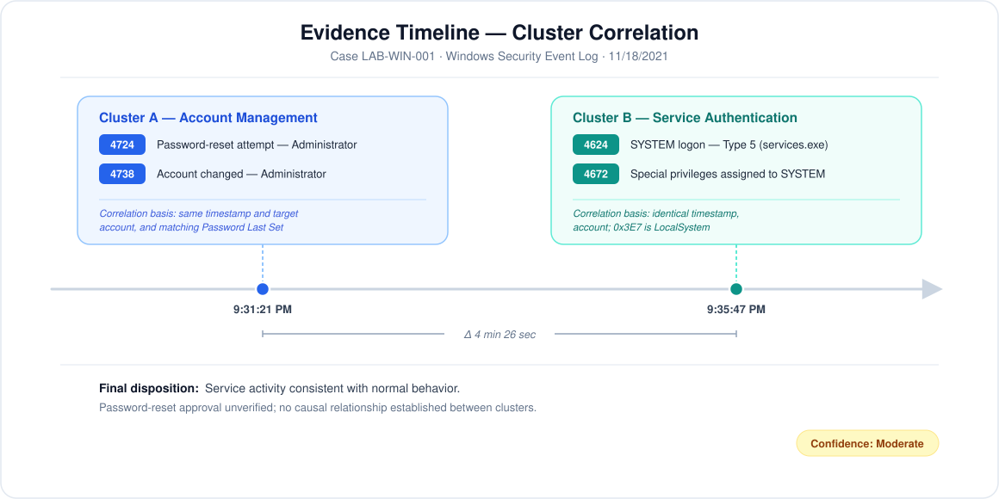

# Windows Security Log Triage: Administrator Password Reset & SYSTEM Activity

## 60 Second View

**Problem:** Determine whether an Administrator password reset and later privileged SYSTEM activity indicated unauthorized access.

**Evidence:** Reviewed **four Windows Security events**: 4724 and 4738 corroborated an Administrator password change; 4624 and 4672 showed a separate SYSTEM service logon. The service account, Logon Type 5, and `services.exe` supported expected service behavior.

**Final disposition:** **No incident confirmed from the four reviewed events.** The SYSTEM activity was consistent with normal service authentication. Password-reset authorization remained unverified and would require approval checks before closure.

*Key screenshot: Event 4738 corroborates the password-change timing; it does not establish approval. Full evidence and analysis follow below.*

---

**Jump to:** [60 second view](#60-second-view) · [Timeline](#evidence-timeline) · [Password reset](#finding-1-administrator-password-reset) · [SYSTEM activity](#finding-2-privileged-system-service-activity) · [Assessment](#final-assessment) · [Follow-up](#what-i-would-do-next-in-a-production-soc) · [Evidence handling](#log-export-and-evidence-handling) · [Limitations](#scope-and-limitations)

## Executive Summary

I analyzed selected Windows Security events from an authorized uCertify training VM to determine whether an Administrator password reset and later privileged activity indicated unauthorized access.

The Security log contained **6,530 events**. I manually analyzed four security-relevant records—**4724, 4738, 4624, and 4672**—and grouped them into two activity clusters:

1. An Administrator password reset and account-change event.
2. A local SYSTEM service logon that received expected operating-system privileges.

The Administrator password-reset attempt was strongly corroborated by a matching account-change event and Password Last Set timestamp, but subsequent authentication was not independently tested and authorization was unverified. The later privileged activity belonged to `NT AUTHORITY\SYSTEM`, not Administrator, and was consistent with normal Windows service authentication.

**Final assessment:** No incident was confirmed from the four events reviewed. In a production SOC, I would keep the Administrator password-reset activity open until its authorization was validated.

> This conclusion applies only to the evidence reviewed. It does not prove the entire host was free from compromise.

---

## Project Overview

| Field | Details |
|---|---|
| Case ID | `LAB-WIN-001` |
| Status | Completed lab investigation |
| Author | Xavier Tables |
| Documentation updated | October 9, 2026 |
| Environment | Authorized uCertify Windows training VM |
| Data source | Windows Security Event Log |
| Tool | Windows Event Viewer |
| Events in source log | 6,530 |
| Events manually analyzed | 4 |
| Investigation focus | Administrator password reset and later privileged activity |
| Final disposition | SYSTEM service activity consistent with normal Windows behavior; password-reset authorization unverified |
| Confidence | Moderate |

### Skills Demonstrated

- Windows Event Viewer and Security log analysis
- Authentication and account-management event interpretation
- Event correlation using timestamps, accounts, logon types, processes, and Logon IDs
- Distinguishing service authentication from interactive or remote user logons
- Privileged-account triage
- Evidence-based conclusions and escalation planning
- Security log export and evidence handling

---

## Investigation Question

**Did the Administrator password reset and later privileged logon activity indicate unauthorized access?**

To answer that question, I reviewed selected Windows Security events and compared:

- Event IDs and timestamps
- Subject and target accounts
- Logon IDs and logon types
- Process names and process IDs
- Source network information
- Authentication details
- Account-change fields
- Assigned privileges

I did not treat any single event as the answer. I compared the account, time, logon type, process, and surrounding context before deciding what the activity actually supported.

---

## Filtering Method

I used Windows Event Viewer to locate selected security-relevant Event IDs related to account management, successful logons, and privileged sessions.

The **6,530** figure represents the total number of events in the source Security log. I did **not** manually analyze all 6,530 records. This investigation is limited to the four events documented below.

---

## Evidence Timeline

| Time | Event ID | Observation | Initial Interpretation |
|---|---:|---|---|
| 11/18/2021 9:31:21 PM | 4724 | Password-reset activity targeting `Administrator` | Privileged account activity requiring validation |
| 11/18/2021 9:31:21 PM | 4738 | `Administrator` account changed; Password Last Set matched the timestamp | Strongly corroborated a password change; authentication untested |
| 11/18/2021 9:35:47 PM | 4624 | `NT AUTHORITY\SYSTEM` logged on using Logon Type 5 through `services.exe` | Consistent with a local service logon |
| 11/18/2021 9:35:47 PM | 4672 | Sensitive privileges assigned to the SYSTEM session | Expected context for a privileged SYSTEM session |

---

## Finding 1: Administrator Password Reset

### Event 4724 — Password-Reset Activity

| Field | Observed Value |
|---|---|
| Log | Security |
| Timestamp | 11/18/2021 9:31:21 PM |
| Provider | Microsoft Windows security auditing |
| Keyword | Audit Success |
| Subject account | `WIN-KRLBFUPGGRQ$` under SYSTEM context |
| Subject Logon ID | `0x3E7` |
| Target account | `Administrator` |
| Event computer | `WIN-KRLBFUPGGRQ` |
| Source IP | Not provided |
| Message | An attempt was made to reset an account's password |

#### My Analysis

Event 4724 stood out because an Administrator password reset is a privileged action. If it were unauthorized, it could be part of gaining or maintaining access to a powerful account.

At the same time, the event did not tell me *why* the reset happened. The same event can appear during legitimate administration, so I treated it as something that needed more context rather than calling it malicious on its own.

---

### Event 4738 — Administrator Account Changed

| Field | Observed Value |
|---|---|
| Timestamp | 11/18/2021 9:31:21 PM |
| Target account | `Administrator` |
| Password Last Set | 11/18/2021 9:31:21 PM |
| Old UAC value | `0x210` |
| New UAC value | `0x210` |
| Message | A user account was changed |

#### My Analysis

Event 4738 strengthened the investigation because it showed that the Administrator account changed at the same time as the 4724 password-reset activity.

The matching **Password Last Set** timestamp strongly corroborated that the Administrator password changed at the recorded time. I did not independently test subsequent authentication.

The old and new UAC values were the same, so I did not observe an account-control change in this record.

The matching timestamp strongly supported a completed password change, but did not independently verify subsequent authentication or answer the authorization question. The lab did not include a help-desk ticket, change request, maintenance record, or administrator confirmation that explained why the reset happened.

---

## Finding 2: Privileged SYSTEM Service Activity

### Event 4624 — Successful SYSTEM Logon

| Field | Observed Value |
|---|---|
| Timestamp | 11/18/2021 9:35:47 PM |
| New logon account | `NT AUTHORITY\SYSTEM` |
| Logon ID | `0x3E7` |
| Logon type | `5` — Service |
| Elevated token | Yes |
| Process ID | `0x228` |
| Process name | `C:\Windows\System32\services.exe` |
| Logon process | `Advapi` |
| Authentication package | `Negotiate` |
| Source IP and port | Not provided (`-`) |

#### My Analysis

Event 4624 showed a successful logon involving `NT AUTHORITY\SYSTEM`.

The combination of:

- `NT AUTHORITY\SYSTEM`
- **Logon Type 5**
- `services.exe`
- no remote source IP or port in the event

supported the conclusion that this was a Windows service logon rather than a remote Administrator login.

I did not rely on one field to call the activity normal. The SYSTEM account, Logon Type 5, `services.exe`, and the lack of a remote source all pointed in the same direction when viewed together.

---

### Event 4672 — Special Privileges Assigned

Event 4672 occurred at the same timestamp and involved the SYSTEM account and Logon ID `0x3E7`. The assigned privileges included sensitive rights such as:

- `SeDebugPrivilege`
- `SeBackupPrivilege`
- `SeRestorePrivilege`
- `SeImpersonatePrivilege`

#### My Analysis

Event 4672 looked important at first because the session received powerful privileges. The next question for me was who actually owned that session.

When I matched it back to Event 4624, the context changed. The session belonged to `NT AUTHORITY\SYSTEM` and came from a Type 5 service logon through `services.exe`. That made the privileges fit normal SYSTEM behavior much better than a malicious user gaining elevation.

---

## Correlating the Events

The useful part of this project was seeing how separate Windows events can build a larger picture without automatically belonging to the same story.

I organized the evidence into two clusters so I could keep the correlations that were supported and avoid inventing a connection just because the timestamps were close.

### Cluster A — Account Management

- **4724:** Administrator password-reset activity
- **4738:** Administrator account changed
- **Correlation basis:** same timestamp, same target account, and matching Password Last Set value

Together, these events strongly supported that the Administrator password changed at the recorded time; subsequent authentication was not independently tested.

They did **not** prove that the reset had been authorized.

### Cluster B — Service Authentication

- **4624:** SYSTEM service logon
- **4672:** sensitive privileges assigned to the SYSTEM session
- **Correlation basis:** same timestamp, account context, and related service-logon activity

The evidence was consistent with normal Windows service behavior.

### Why I Did Not Combine Both Clusters Into One Attack Story

The service activity occurred only several minutes after the password reset, but timing alone was not enough to prove that one event caused the other.

The later successful logon belonged to **SYSTEM**, not Administrator, and its characteristics were consistent with service authentication.

I therefore kept the two clusters separate rather than claiming a connection that the available evidence did not establish.

---

## Final Assessment

Based on the four events reviewed:

- The Administrator password-reset attempt and matching account-change record strongly corroborated a password change; subsequent authentication was not independently verified.
- The available lab evidence did not establish whether the password reset was authorized.
- The later successful logon belonged to SYSTEM, not Administrator.
- Logon Type 5 and `services.exe` supported normal Windows service activity.
- Event 4672 was consistent with the expected privileges of the SYSTEM session.
- None of the four reviewed events showed an interactive or remote Administrator logon.

**Disposition:** No incident was confirmed from the four events reviewed. The SYSTEM service activity was consistent with normal Windows behavior, while the Administrator password reset would require approval validation in a production environment.

**Confidence:** Moderate.

This result is limited to the evidence I reviewed. It does not establish that the host was completely free from compromise because other activity could exist outside the selected events or outside the available log data.

---

## What I Would Do Next in a Production SOC

If this occurred in a real environment, I would:

1. Check for an approved password-reset ticket, change request, or maintenance record.
2. Confirm the reset with the responsible administrator or account owner when appropriate.
3. Review nearby successful and failed authentication events involving the Administrator account.
4. Look for suspicious process creation or service activity around the same time.
5. Review events such as 4625, 4648, 4688, 4697, or System Event 7045 when relevant.
6. Correlate the activity with SIEM, EDR, Sysmon, identity, and network telemetry if available.
7. Document the final disposition and preserve relevant evidence.

I would escalate the case if the reset could not be matched to an authorized action or if surrounding evidence showed suspicious authentication, process execution, service installation, or privileged-account activity.

---

## Log Export and Evidence Handling

I exported the Security log as `security_logs.evtx` for preservation and possible analysis in another platform.

Before publishing real security logs, I would review them for sensitive usernames, hostnames, IP addresses, and organizational information.

For this portfolio, I used screenshots to demonstrate the investigation without publishing the full event-log dataset.

---

## What I Learned

The biggest lesson from this project was that one Windows event rarely tells the whole story. The useful information came from comparing the account, timestamp, Logon ID, logon type, process, and nearby events instead of judging each record by its Event ID alone.

It also taught me not to connect events just because they happen close together. The password-reset activity and the later SYSTEM service activity were both security-relevant, but the evidence did not support turning them into one attack chain.

That became an important rule for how I investigate now: **interesting or privileged activity is not automatically malicious. Context has to support the conclusion.**

---

## Scope and Limitations

This investigation used selected Windows events from an authorized uCertify training VM.

I did not use a SIEM, EDR platform, or Sysmon in this project, and I do not present those tools as part of the completed work.

The investigation is limited to the four documented events and the evidence available in the training environment. The lab did not provide production ticketing records, full process lineage, endpoint telemetry, or broader network evidence.

I did not assign a MITRE ATT&CK technique because the reviewed evidence did not establish malicious activity.

---

## References

- [Microsoft Learn: Event 4624 — An account was successfully logged on](https://learn.microsoft.com/en-us/previous-versions/windows/it-pro/windows-10/security/threat-protection/auditing/event-4624)
- [Microsoft Learn: Event 4672 — Special privileges assigned to new logon](https://learn.microsoft.com/en-us/previous-versions/windows/it-pro/windows-10/security/threat-protection/auditing/event-4672)
- [Microsoft Learn: Event 4724 — An attempt was made to reset an account's password](https://learn.microsoft.com/en-us/previous-versions/windows/it-pro/windows-10/security/threat-protection/auditing/event-4724)
- [Microsoft Learn: Event 4738 — A user account was changed](https://learn.microsoft.com/en-us/previous-versions/windows/it-pro/windows-10/security/threat-protection/auditing/event-4738)

---

*All activity was performed in an authorized training environment. Screenshots and analysis are from my own lab session. The 2021 timestamps came from a preloaded uCertify training dataset.*
