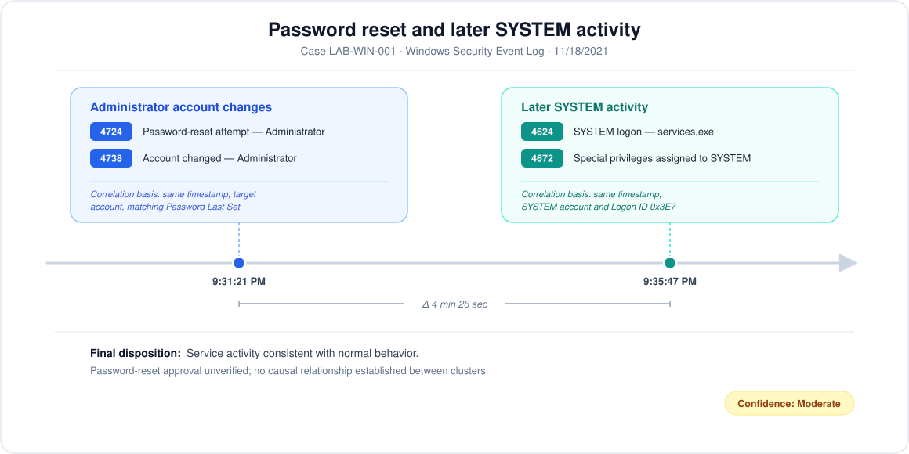

# Windows Security Log Triage: Password Reset and SYSTEM Activity

**Case:** LAB-WIN-001 · **Environment:** uCertify Windows training VM · **Tool:** Event Viewer

[Portfolio](../../README.md) · [Evidence index](#evidence)

## Summary

**Question:** Did an Administrator password reset and later privileged SYSTEM activity belong to the same suspicious sequence?

**Work performed:** I manually compared four Event Viewer records, checking timestamps, accounts, Logon IDs, processes, and account-change fields.

**Finding:** Events 4724 and 4738 supported an Administrator password change. The later 4624/4672 records were consistent with SYSTEM service activity, so I kept the two groups separate.

**Status:** Moderate confidence within the four-record scope. Password-reset authorization remains unverified, and these records do not establish a broader host-security conclusion.

**Evidence:** [Screenshots](#evidence) · [Event timeline](#scope-and-timeline). The raw EVTX is unavailable; the repository retains the export screenshot.

## Scope and timeline

The source Security log contained **6,530 events**. I manually examined **four** selected records, comparing timestamps, accounts, Logon IDs, processes, and account-change fields. The displayed November 18, 2021 timestamps came from the preloaded training data.

| Displayed time | Event | Observation |
| --- | --- | --- |
| 9:31:21 PM | 4724 | Administrator password-reset attempt; Audit Success |
| 9:31:21 PM | 4738 | Administrator account changed; Password Last Set matched the reset time |
| 9:35:47 PM | 4624 | SYSTEM logon; `services.exe`; Logon ID `0x3E7` |
| 9:35:47 PM | 4672 | Sensitive privileges assigned in the SYSTEM context |

## Why I kept the events separate

Event 4672 caught my attention because it records sensitive privileges. My interpretation changed when I checked the related 4624 event: the account was SYSTEM, the process was `services.exe`, and the Logon ID was `0x3E7`. Those details pointed toward routine service activity. A four-minute gap alone did not connect it to the password reset.

The 4624 record showed `NT AUTHORITY\SYSTEM`, `services.exe`, and dashes for source IP/port. Event 4672 at the same displayed time listed `SeDebugPrivilege`, `SeBackupPrivilege`, `SeRestorePrivilege`, and `SeImpersonatePrivilege`.

## Administrator password change

Event 4724 named Administrator as the target and the computer account `WIN-KRLBFUPGGRQ$` as the subject under SYSTEM context. Event 4738 showed a matching Password Last Set timestamp; its old and new UAC values were both `0x210`.

Together, these records strongly corroborated a password change. The lab did not provide an approval record or a follow-up authentication test.

## Recommended follow-up

I would check the reset ticket or change record with the responsible administrator, then review nearby Administrator authentication and relevant process/service events. An unapproved reset or corroborating suspicious activity would justify escalation.

The reviewed records support an interpretation of these events. A broader host-security assessment would require additional endpoint and network evidence.

## Evidence

I exported the Security log as `security_logs.evtx` in the training VM. **This repository contains the export screenshot; the raw EVTX file is unavailable for download.**

| Screenshot | What it shows |
| --- | --- |
| [4724: Password reset](evidence/ac5ea633-98af-448d-9494-0c9ae7b92020.png) | Administrator target, SYSTEM subject, Logon ID `0x3E7`, and Audit Success at 9:31:21 PM |
| [4738: Account change](evidence/14b8b493-6ed4-4d86-b2e7-7dfeafe523d8.png) | Administrator target and SYSTEM subject at the same displayed time |
| [4738: Changed attributes](evidence/45a70e3a-aa9f-4813-ae95-99d8b8b35233.png) | Password Last Set at 9:31:21 PM; old/new UAC values both `0x210` |
| [4624: SYSTEM logon](evidence/58554701-3442-490a-b343-e9d28a6551ae.png) | SYSTEM, `services.exe`, Logon ID `0x3E7`, and dashes for source IP/port |
| [4672: SYSTEM privileges](evidence/f7b81dbf-abcb-4bbb-a7b1-7cf7179a4120.png) | SYSTEM, Logon ID `0x3E7`, and the listed privileges at 9:35:47 PM |
| [Saved EVTX export](evidence/59c01585-3317-480e-815b-5e3ab20b748e.png) | `security_logs.evtx` selected in Documents |
| [Event Viewer overview](evidence/15148a3a-94cf-4fe9-ae0c-73f3a28623d8.png) | Overview and Summary page with available logs |

## What I learned

The account and process context mattered more than the event's alarming-looking privilege list. Checking those fields kept me from treating normal SYSTEM activity as evidence of an Administrator compromise.

## References

- [Microsoft: Event 4624](https://learn.microsoft.com/en-us/previous-versions/windows/it-pro/windows-10/security/threat-protection/auditing/event-4624)
- [Microsoft: Event 4672](https://learn.microsoft.com/en-us/previous-versions/windows/it-pro/windows-10/security/threat-protection/auditing/event-4672)
- [Microsoft: Event 4724](https://learn.microsoft.com/en-us/previous-versions/windows/it-pro/windows-10/security/threat-protection/auditing/event-4724)
- [Microsoft: Event 4738](https://learn.microsoft.com/en-us/previous-versions/windows/it-pro/windows-10/security/threat-protection/auditing/event-4738)
